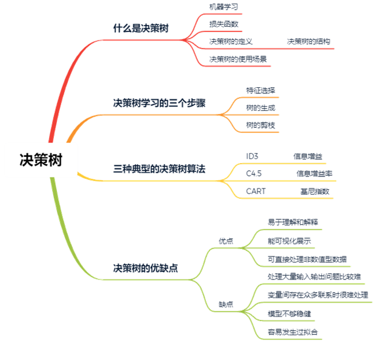
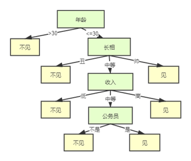
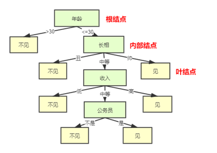
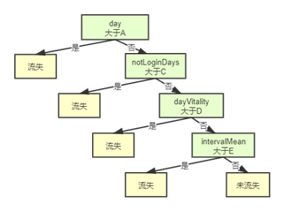

 

决策树是很多刚接触机器学习的小伙伴都会去学习了解的一种方法。但是很多机器学习书本里关于决策树的部分都需要读者具有一定基础才能很好的理解。从机器学习入门的角度出发，分享一下我对决策树的理解，希望对大家有帮助！

## 1、决策树是什么？

**决策树是一种逻辑简单的机器学习算法**。因此，在介绍决策树之前，先来了解一下机器学习。

### **1.1机器学习**

“天气预报”就是机器学习的一个应用。今天一整天都是阴天，房间地面也很潮湿，到晚上天空还出现厚厚的乌云，那我们直观猜测明天会下雨。这个过程其实就是我们人体根据以往的经验和近期的天气数据做的一个预测与分析。机器学习就是“机器”根据历史的温度、风速、空气湿度、天气阴晴等数据进行学习，发现数据内部的规律与复杂的联系，来预测未来的天气状况。机器学习的对象是数据，通过对数据进行处理和建模，达到对未知情况进行预测分析的目的。

机器学习有监督学习、无监督学习、半监督学习与强化学习。**决策树是监督学习的一种**。监督学习要求给出的一堆样本（被抽中的研究对象）中，每个样本都有一组属性（温度、风速、空气湿度…）和一个分类结果（阴天or晴天），那么通过学习这些样本得到一个决策树，这个决策树能够对新的数据给出正确的分类，那就是我们要达到的目的。

学好机器学习方法要重点掌握它的三要素：模型、策略和算法。机器学习模型就是总结样本中的“经验”，学习出来的一个模型，通过这个模型，可以对具有特征的样本进行预测，得到一个具体的预测值（回归）或者类别（分类）。而机器学习的“学习”过程，也就是它的学习策略，是**最小化损失函数**的过程。决策树算法通常有ID3、C4.5和CART三种。

### **1.2损失函数**

在一堆模型中，按照什么标准去选择最优的那个模型是分析过程中要重点考虑的。**损失函数就是模型选择的标准**。

对于机器学习而言，损失函数就像一把尺子，用来度量模型、指导模型训练用。用它可以直接衡量模型的预测值和真实值不一样的程度，如果预测出的结果与实际结果偏离较远，我们通过预测结果进行决策时，需要付出的代价就会越大，或者说获得的损失就会越大，损失函数会得到一个非常大的值。比如：今天本来是晴天，但是一周前天气预报显示今天一整天都是大雨，因此原计划今天订机票赴外地谈的合同，因为一周前错误的（偏离实际很远的）天气预报推到了第二天，迟一天签合同可能就直接损失了一千亿。所以损失函数取值越小，模型的性能越好。关于常用的损失函数，不懂的小伙伴可以再去补充一下知识点。

### **1.3决策树原来是这样的！**

决策树模型（Decision Tree model）是一个模拟人类决策过程思想的模型。它简单、逻辑清晰、有很强的可解释性。一个不经意，你可能就用到了它！相亲有了解吗？来了解一下？母亲为女孩介绍男朋友，女儿内心的决策过程（见图1）。

D:对方年龄多大？（属性：年龄）

M：26

D:长得帅不帅？（属性：长相）

M:中等吧

D:收入高不高：（属性：收入）

M:不算太高，中等

D:是不是公务员？（属性：是否公务员）

M:是，在税务局上班

D：那好，我去见见！（类别：见）

 

图1 内心决策过程

 
女儿内心的决策过程就是一棵决策树“长成”的过程。由此可见，决策树是一种（倒立的）树形结构，基于“树”结构进行决策，由结点和有向边组成（图2）。

·内部结点：某个特征属性（年龄、长相、收入等）的判断，每个分支对应于该判断的一种结果

·外部结点（叶结点）：类别划分（你“见”或“不见”，他都在那里）

 

图2 决策树模型

## 2、决策树“初长成”经历了什么？

决策树学习的本质是从训练数据集（存放着部分历史数据：特征属性与分类结果）中归纳出一组分类规则，一组分类规则对应一棵决策树。如果“女儿”首先考虑的不是对方的年龄，而是长相，那又会产生另外一棵决策树。这样能产生很多不同的决策树模型。我们需要的是从这些模型中选择一个能很好的拟合训练数据的决策树模型，同时，它对未知样本（新出现的个体）也能做到比较不错的预测。

在决策树的学习过程中通常包括3个步骤：特征选择、决策树的生成和决策树的修剪。

·**特征选择**：特征选择在于选取对训练数据具有分类能力的特征，这样可以提高决策树的学习效率。如果利用一个特征进行分类的结果与随机分类的结果没有很大的差别，则称这个特征是没有分类能力的。常用的准则有信息增益、信息增益比、基尼指数3种，下面会具体介绍这3个指标。

·**决策树生成**：通常使用信息增益最大、信息增益比最小或者是基尼指数最小作为特征选择的准则。通过计算信息增益或者其他指标，从根结点开始，递归地产生决策树。这相当于用信息增益或者其他准则不断选取局部最优特征，或将训练集划分为能够基本正确分类的子集。

·**决策树剪枝**：主动去掉部分分支，防止过拟合。

有了特征选择的准则，生成一棵决策树也就不难了。

## 3、“长成”一棵决策树会用到什么算法？

学习决策树的重点和核心就是了解它的生成算法！下面围绕一个具体的游戏用户流失案例来学习决策树的三种算法。

在游戏中，我们通常会研究用户流失的问题，根据用户近期的登录情况、活动参与情况、战斗信息等等来看某一用户将来是否流失。之前的各种数据行为体现了“流失用户”与“非流失用户”不同的特征属性，那现在给你一个玩家的行为数据你来预测一下他将来是否会流失。

给出如下的一组数据（表1），一共有十个样本（用户数量），有每个样本最近一周登录天数（day）、最近一次登录到统计截至日期的间隔天数（notLoginDays）、最近一周获取活跃的天数（dayVitality）、统计期内登录平均间隔天数（intervalMean）四个属性，最后判断这些用户将来是否会流失（isLoss）。表格最后一列是根据实际流失情况划分的分类结果。

| **用户编号** | **day** | **notLoginDays** | **dayVitality** | **intervalMean** | **isLoss(分类:是否流失)** |
| :----------: | :-----: | :--------------: | :-------------: | :--------------: | :-----------------------: |
|      1       |    0    |        6         |        0        |        18        |            是             |
|      2       |    0    |        6         |        0        |        1         |            是             |
|      3       |    0    |        6         |        0        |        7         |            是             |
|      4       |    1    |        1         |        0        |        7         |            否             |
|      5       |    1    |        1         |        0        |        2         |            否             |
|      6       |    5    |        1         |        5        |        0         |            否             |
|      7       |    1    |        1         |        0        |        5         |            是             |
|      8       |    1    |        1         |        0        |        3         |            否             |
|      9       |    1    |        1         |        0        |        9         |            否             |
|      10      |    2    |        1         |        0        |        3         |            否             |

 
然后用这一组附带分类结果的样本可以训练出多种多样的决策树，这里为了简化过程，我们假设决策树为二叉树，且类似于下图3：

 

图3.决策树

是不是会疑问，为什么样本最近一周登录天数（day）被放在了根结点，没有考虑把其他变量放到根结点吗？其他内部结点又是怎么选取的呢？这里就用到了生成决策树的算法。ID3、C4.5和CART三种决策树生成算法分别对应信息增益、信息增益比、基尼指数三种准则。在理解这三种生成算法之前，先对“熵”的概念熟悉一下，因为“熵”对于这三种算法来说真的太重要了。

### **3.1熵**

熵表示随机事件不确定性的程度，熵越大，事件的不确定性就越大。对于一组数据，熵越小就说明分类结果会越好，事件X的熵可以记作H(X)或者H(p)。**熵定义**如下：
$$
H(X)=-\sum_{r=1}^np_ilog(p_i)
$$
其中p(x_i) 为x_i出现的概率，即我们常说的可能性。假如是2分类问题，当A类和B类各占50%的时候，
$$
H(X)=-[\frac 12log_2(\frac 12)+\frac 12log_2(\frac 12)]=1
$$
当只有A类，或只有B类的时候，
$$
H(X)=-[1*log_2(1)+0]=0
$$
所以当熵最大为1的时候，是分类效果最差的状态，当它最小为0的时候，不存在不确定性，是完全分类的状态。因为熵等于零是理想状态，一般情况下，熵介于0和1之间。

条件熵H(Y|X)同熵H(X)一样，都是不确定性的一种衡量，它表示在已知某一事件X的条件下事件Y的不确定性。事件X给定的条件下Y的**条件熵H(Y|X)**定义如下：
$$
H(Y|X)=\sum_{i=1}^np_iH(Y|X=x_i)\\
H(Y|X=x_i)=-\sum_{j=1}^mp(y_j|X=x_i)log(p(y_j|X=x_i))
$$
其中p(y_j|X=x_i)为事件X取x_i时，y_j出现的概率。

### **3.2 ID3算法**

ID3算法由信息增益（增熵）来决定哪个做父结点，哪个结点需要分裂。**信息增益**（information gain）g(Y,X)表示得知样本特征属性X的信息而使得数据集Y的信息的不确定性减少的程度。我们通常希望知道一个样本的某一属性信息后，他的类别就更明确，也就是类别不确定性减少更多。
$$
g(Y,X)=H(Y)- H(Y|X)
$$
假设现在什么信息都不知道，给个游戏用户id直接问你这一用户是否流失（y_i），你随机猜测的结果正确的可能性都是50%。但是，如果告诉你这个用户最近一周每天都有登录游戏（x_1）,那你猜测他是非流失用户就是完全正确的。就是知道了用户的登录情况之后，用户类别不确定性就减少了很多（已经没有不确定性了），那这个属性对用户类别有很强的分类能力，它的信息增益(H(Y|X=x_1))很大。另外，如果只是告诉你这个用户是广东人（x_2），你猜测他是流失的，猜测正确的可能性是51%。知道了用户是否是广东人，用户类别不确定性只减少了一点点，那这个属性就是对用户类别区分没什么作用，它的信息增益(H(Y|X=x_2))很小。所以，在做特征选择时，会选择信息增益最大的特征作为此次分裂的结点。

上表中的4个属性：单一地通过以下规则分类：

| **id** | **规则**       | **预测类别** | **错分样本个数** |
| :------: | :--------------: | :------------: | :----------------: |
| 1      | day=0          | 流失         | 1                |
| 2      | notLoginDays>5 | 流失         | 1                |
| 3      | dayVitality=0  | 流失         | 5                |
| 4      | intervalMean>4 | 流失         | 2                |

最后发现最近一周登陆天数等于0（day=0）为【流失】和最近一次登录到统计截至日期的间隔天数大于5（notLoginDays>5）为【流失】都只是错分了1个，也就是熵（不确定性）最小，信息增益最大，所以应该选择day或notLoginDays为父结点进行树的生成都可以，当然最近一次登录到统计截至日期的间隔天数也可以选择大于3，大于4等等，总之会有很多类似上述1~4的条件，最后选择分类错最少即不确定性最小，信息增益最大的那个条件。而当分裂子结点时道理也一样，分裂有很多选择，针对每一个选择，与分裂前的分类错误率比较，留下那个提高最多的选择，即信息增益最大的选择。

但是ID3存在一个问题，那就是越细小的分割，分类错误率越小，所以ID3会越分越细。分割太细了，训练数据的分类可以达到0错误率，但是因为新的数据和训练数据不同，所以面对新的数据分错率反倒上升了。以用户id为根节点进行划分，每个用户都有独有的id,n个样本就会被分成n个子集，每个样本能直接对应类别流失与否。但是新进入的用户，其用户id与前面用户都不相同，那么划分的很细的这棵决策树模型对这个心用户并没有很好地识别作用。我们其实并不要这么仔细的划分！

### **3.3 C4.5算法**

C4.5中优化项要除以分割太细的代价，这个比值叫做信息增益率。为了避免分割太细造成的过拟合，C4.5对ID3进行了改进。以信息增益作为划分训练集的特征，存在偏向于选择取值较多的特征(例：用户id）的问题，信息增益率（information gain ratio）就可以对这一问题进行修正。特征X对数据集Y的**信息增益率gR(Y,X)**定义如下：
$$
g_R(Y,X)=\frac {g(Y,X)}{H_X(Y)} \\
H_X(Y)=-\sum_{i=1}^n(\frac {|Yi|}{|Y|}log(\frac {|Yi|}{|Y|})
$$
HX(Y)是数据集Y被特征X划分成不同子集的熵。|Yi|为子集Yi的样本个数，|Y|为数据集Y的样本个数。如果上表用户流失的问题，以用户id（X）作为根节点进行划分，那数据集Y就会被分成10个子集（Yi）,每个子集都只包含1个样本（|Yi|=1），则HX(Y)=-10*(1/10)*log(1/10)=1(熵的取值为[0,1])。显然分割太细分母增加，信息增益率会降低。除此之外，其他的原理和ID3相同,最终选择信息增益率最大的特征作为分割结点，权衡树的复杂度与分类准确度来建立决策树模型。

### **3.4 CART算法**

CART是分类回归树，是应用广泛的决策树学习方法。它是一个二叉树，内部结点特征的取值为“是”和“否”，二分每个特征，左分支取值为“是”的分支，右分支取值为“否”的分支，样式见上文图3。

CART只能将一个父结点分为2个子结点。CART用gini指数来决定如何分裂。分类问题中，假设有K个类，样本属于第K类的概率为pk，那么**基尼指数**定义为：
$$
gini(p)=\sum_{k=1}^K(p_k(1-p_k))=1-\sum_{k=1}^Kp_k^2
$$
也就是说总体包含的类别越杂乱，gini指数就越大（跟熵的概念很相似）。对于游戏用户流失的二分类问题，如果某一样本属于流失的概率是p，则gini指数为2p(1-p)。

对于给定的样本集合Y，其gini指数为：
$$
gini(Y)=1-\sum_{k=1}^K(\frac {|C_K|}{|Y|})^2
$$
Ck是样本集合Y中中属于第k类的样本子集，K是类的个数。根据上表10个样本用户流失的情况，可以得出gini指数
$$
gini(Y)=1-[(\frac 5{10})^2+(\frac 5{10})^2]=1/2
$$
如果样本集合Y根据特征X是否取某一可能的值a被分割成Y1和Y2两个部分，则在特征下，集合Y的基尼指数定义为：
$$
gini(Y，X)=\frac {|Y_1|}{|Y|}gini(Y_1)+\frac {|Y_2|}{|Y|}gini(Y_2)
$$
gini(Y)表示集合Y的不确定性，gini(Y，X)表示经X=a分割后集合Y的不确定性。gini指数越大，样本集合的不确定性越大。通过玩家最近一周登陆天数（day）来制定分类规则：

|      | **规则** | **子集里样本的类别1** | **规则** | **子集里样本的类别2** |
| :--: | :------: | :-------------------: | :------: | :-------------------: |
|  a   |  day>1   |  流失用户&非流失用户  |  day<=1  |  流失用户&非流失用户  |
|  b   |  day>=1  |  流失用户&非流失用户  |  day<1   |       流失用户        |

比较a和b，发现b的凌乱程度比a要小，即gini指数b比a小，所以选择b的方案。以此为例，将所有条件列出来，选择gini指数最小的方案，这个和熵的概念很类似。

CART还是一个回归树，回归解析用来决定分布是否终止。理想地说每一个叶结点里都只有一个类别时分类应该停止，但是很多数据并不容易完全划分，或者完全划分需要很多次分裂，必然造成很长的运行时间，所以CART可以对每个叶结点里的数据分析其均值方差，当方差小于一定值可以终止分裂，以换取计算成本的降低。

## 4.总结

### **4.1三种决策树算法的联系与区别**

决策树的分类规则都是互斥并且完备的。但CART是二叉树，而ID3、C4.5有几个值就划分为几个叶子结点。

（1）CART既可以做分类，又可以做回归，而ID3、C4.5只是用于分类。

（2）CART对于特征的利用是可以重复的，而作为分类的ID3、C4.5则是不能重复利用特征。

（3）CART和ID3一样，存在偏向细小分割，即过度学习（过度拟合的问题），为了解决这一问题，对特别长的树进行剪枝处理，直接剪掉。

### **4.2决策树的优缺点分析**

#### **优点**

（1）易于理解和解释，甚至比线性回归更直观；

（2）与人类做决策思考的思维习惯契合；

（3）模型可以通过树的形式进行可视化展示；

（4）可以直接处理非数值型数据。

#### **缺点**

（1）对于有大量数值型输入和输出的问题，决策树未必是一个好的选择；

（2）特别是当数值型变量之间存在许多错综复杂的关系，如金融数据分析；

（3）决定分类的因素取决于更多变量的复杂组合时；

（4）模型不够稳健，某一个节点的小小变化可能导致整个树会有很大的不同。

因为决策树算法过于简单，对于一些比较复杂逻辑关系的数据，决策树无能为力，或者容易出现过拟合，尤其是在网络游戏中单玩家可以执行的动作超过 4000 个，各种属性十分复杂的情形下，因此出现了集成模型。

 

 
